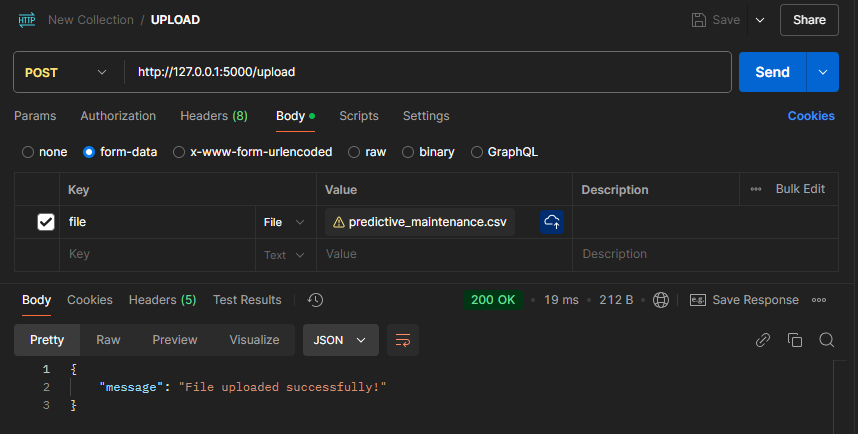

# Predictive Maintenance Analysis w/ REST-API

This project provides a **RESTful API** for predicting machine downtime using a simple **Logistic Regression** model. The model is trained on a manufacturing dataset to predict machine failures or downtime, helping improve maintenance planning and reduce unplanned production disruptions.

## Project Overview

The Predictive Maintenance API allows users to:

- **Upload** manufacturing data in CSV format.
- **Train** a predictive model on the uploaded data.
- **Make predictions** on machine downtime based on new input data.

This API is built using **Flask** for the backend and uses **scikit-learn** for machine learning. The model is trained on a dataset of machine parameters and downtime status to predict whether a machine will experience downtime, given certain input conditions.

---

## Files

- **Jupyter Code** (with preprocessing, visualisation, prediction): [Jupyter Notebook](defect.md) <br>
- **Python Code** (without API): [defect.py](defect.py) <br>
- **Flask Code** (with API): [app.py](app.py) <br>
- **Dataset**: [predictive_maintenance.csv](data/predictive_maintenance.csv) <br>
- **Model** (pickle): [downtime_model.pkl](model/downtime_model.pkl) <br>
- **Postman Collection**: [MAC-DOWNTIME.postman_collection.json](MAC-DOWNTIME.postman_collection.json)
## Features

- **Upload** endpoint: Upload manufacturing data for training.
- **Train** endpoint: Train the model based on the uploaded dataset.
- **Predict** endpoint: Predict machine downtime based on input parameters.

## Requirements

To get the project up and running, you'll need the following:

- Python 3.x
- Required Python packages (listed below)

### Required Packages

1. Flask
2. scikit-learn
3. pandas
4. imbalanced-learn

## Installation and Setup

### 1. Clone the Repository

```bash
git clone https://github.com/arindal1/Machine-Maintenance-Analysis
cd Machine-Maintenance-Analysis
```

### 2. Install Dependencies

Create a virtual environment (optional) and install the required dependencies using `pip`:

```bash
# Install dependencies
pip install -r requirements.txt
```

The `requirements.txt` file contains the necessary libraries:


### 3. Running the API

Once the dependencies are installed, you can run the Flask API:

```bash
python app.py
```

The API will start running on `http://127.0.0.1:5000`.

## API Endpoints

### 1. **POST /upload**

This endpoint allows users to upload a CSV file containing manufacturing data. The file must include machine parameters like temperature, run time, etc.

#### Request

- Method: `POST`
- URL: `/upload`
- Content-Type: `multipart/form-data`
- Body: Upload a CSV file.

#### Example Request

```bash
curl -X POST -F "file=@path/to/data.csv" http://127.0.0.1:5000/upload
```

#### Example Response

```json
{
  "message": "File uploaded successfully!"
}
```



<p align="center">[ <strong>/upload</strong> endpoint in Postman]</p>

---

### 2. **POST /train**

This endpoint trains the machine learning model using the uploaded dataset. The model is saved after training and is ready for predictions.

#### Request

- Method: `POST`
- URL: `/train`
- Content-Type: `application/json`

#### Example Request

```bash
curl -X POST http://127.0.0.1:5000/train
```

#### Example Response

```json
{
    "accuracy": 0.82,
    "f1_score": 0.82,
    "message": "Model trained successfully!"
}
```


<p align="center">[ <strong>/train</strong> endpoint  in Postman ]</p>

---

### 3. **POST /predict**

This endpoint allows users to make predictions based on input data such as temperature, run time, etc. The model will predict whether there will be machine downtime (Failure or No Failure).

#### Request

- Method: `POST`
- URL: `/predict`
- Content-Type: `application/json`
- Body: A JSON object with machine parameters.

#### Example Request

```bash
curl -X POST -H "Content-Type: application/json" -d '{
    "Type": "M",
    "Air temperature [K]": 298.1,
    "Process temperature [K]": 308.6,
    "Rotational speed [rpm]": 1551,
    "Torque [Nm]": 42.8,
    "Tool wear [min]": 0
}' http://127.0.0.1:5000/predict
```

#### Example Response

```json
{
  "Downtime": "Yes",
  "Confidence": 0.86
}
```


<p align="center">[ <strong>/predict</strong> endpoint  in Postman ]</p>

---

## How the Model Works

The model uses **Logistic Regression** and is trained on the following machine parameters:

- **Type**: Machine type (categorical)
- **Air temperature [K]**: Temperature of the machine's environment
- **Process temperature [K]**: Temperature during the operation
- **Rotational speed [rpm]**: Speed of the machine's rotation
- **Torque [Nm]**: Torque applied to the machine
- **Tool wear [min]**: Amount of wear on the machine tool

The model predicts whether a machine will experience downtime (Failure = 1) or not (Failure = 0), based on these input parameters.

---

## Example Usage

### Example Request for **/predict**

**Request:**

```json
{
  "Type": "M",
  "Air temperature [K]": 298.1,
  "Process temperature [K]": 308.6,
  "Rotational speed [rpm]": 1551,
  "Torque [Nm]": 42.8,
  "Tool wear [min]": 0
}
```

**Response:**

```json
{
  "Downtime": "No Failure",
  "Confidence": 0.87
}
```

---

## Model Training and Prediction Flow

1. **Upload CSV**: Upload a CSV file containing manufacturing data.
2. **Train Model**: Train the model using the uploaded data.
3. **Predict**: Make predictions for machine downtime using new input data.

---

## External Links

Dataset: [link](https://www.kaggle.com/datasets/shivamb/machine-predictive-maintenance-classification) <br>
Repository: [link](https://github.com/arindal1/Machine-Maintenance-Analysis) <br>
LinkedIn: [link](https://www.linkedin.com/in/arindalchar)

---

