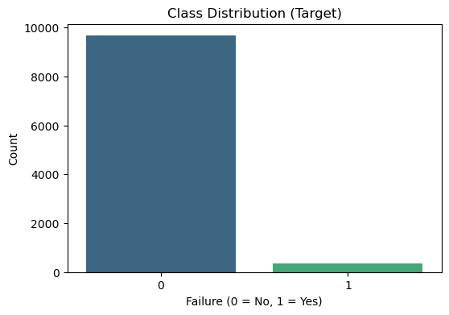
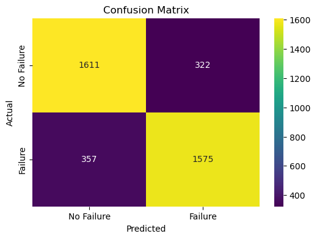
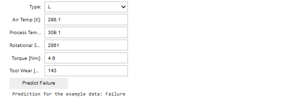

# Machine Predictive Maintenance Classification

This project is a **predictive maintenance model** designed to forecast machine failures based on historical sensor data. It utilizes a **logistic regression model** trained on features such as *air temperature, process temperature, rotational speed, torque*, and *tool wear*. The model is preprocessed using **standard scaling** and **one-hot encoding** to handle *numerical* and *categorical* data. To address **class imbalance**, **Synthetic Minority Over-sampling Technique** (SMOTE) is applied before model training.

Dataset: [link](https://www.kaggle.com/datasets/shivamb/machine-predictive-maintenance-classification) <br>
Repository: [link](https://github.com/arindal1/Machine-Predictive-Maintenance)

---

## Dependencies


```python
import pandas as pd
import numpy as np
import matplotlib.pyplot as plt
import seaborn as sns
import pickle
```


```python
from sklearn.model_selection import train_test_split
from sklearn.preprocessing import StandardScaler, OneHotEncoder
from sklearn.compose import ColumnTransformer
from sklearn.pipeline import Pipeline
from sklearn.linear_model import LogisticRegression
from sklearn.metrics import accuracy_score, f1_score, classification_report, confusion_matrix
from imblearn.over_sampling import SMOTE
```

## Data Preprocessing


```python
data = pd.read_csv('data/predictive_maintenance.csv')
```


```python
print("Dataset Info:")
data.info()
print("\nSample Data:")
print(data.head())
```

    Dataset Info:
    <class 'pandas.core.frame.DataFrame'>
    RangeIndex: 10000 entries, 0 to 9999
    Data columns (total 10 columns):
     #   Column                   Non-Null Count  Dtype  
    ---  ------                   --------------  -----  
     0   UDI                      10000 non-null  int64  
     1   Product ID               10000 non-null  object 
     2   Type                     10000 non-null  object 
     3   Air temperature [K]      10000 non-null  float64
     4   Process temperature [K]  10000 non-null  float64
     5   Rotational speed [rpm]   10000 non-null  int64  
     6   Torque [Nm]              10000 non-null  float64
     7   Tool wear [min]          10000 non-null  int64  
     8   Target                   10000 non-null  int64  
     9   Failure Type             10000 non-null  object 
    dtypes: float64(3), int64(4), object(3)
    memory usage: 781.4+ KB
    
    Sample Data:
       UDI Product ID Type  Air temperature [K]  Process temperature [K]  \
    0    1     M14860    M                298.1                    308.6   
    1    2     L47181    L                298.2                    308.7   
    2    3     L47182    L                298.1                    308.5   
    3    4     L47183    L                298.2                    308.6   
    4    5     L47184    L                298.2                    308.7   
    
       Rotational speed [rpm]  Torque [Nm]  Tool wear [min]  Target Failure Type  
    0                    1551         42.8                0       0   No Failure  
    1                    1408         46.3                3       0   No Failure  
    2                    1498         49.4                5       0   No Failure  
    3                    1433         39.5                7       0   No Failure  
    4                    1408         40.0                9       0   No Failure  
    

#### [checking for missing values]


```python
print("\nMissing Values:")
print(data.isnull().sum())
```

    
    Missing Values:
    UDI                        0
    Product ID                 0
    Type                       0
    Air temperature [K]        0
    Process temperature [K]    0
    Rotational speed [rpm]     0
    Torque [Nm]                0
    Tool wear [min]            0
    Target                     0
    Failure Type               0
    dtype: int64
    

#### [dropping irrelevant columns like product ID, and UID]


```python
data = data.drop(columns=["UDI", "Product ID"])
```

## Data Analysis


```python
plt.figure(figsize=(6, 4))
sns.countplot(data=data, x="Target", palette="viridis")
plt.title("Class Distribution (Target)")
plt.xlabel("Failure (0 = No, 1 = Yes)")
plt.ylabel("Count")
plt.show()
```

    C:\Users\Arindal Char\AppData\Local\Temp\ipykernel_3640\249545066.py:2: FutureWarning: 
    
    Passing `palette` without assigning `hue` is deprecated and will be removed in v0.14.0. Assign the `x` variable to `hue` and set `legend=False` for the same effect.
    
      sns.countplot(data=data, x="Target", palette="viridis")
    


    

    


> Due to the **imbalance** in the dataset (only **68 failure** instances out of **2,000 test** samples), we can use techniques like **oversampling (SMOTE)** or **class weighting in the logistic regression** model to handle the *Class Imbalance*.

#### [defining features and target]


```python
X = data.drop(columns=["Target", "Failure Type"])
y = data["Target"]
```

#### [identify categorical and numerical columns]


```python
categorical_cols = ["Type"]
numerical_cols = [col for col in X.columns if col not in categorical_cols]
```

#### [Preprocessing: Scaling and One-Hot Encoding]


```python
preprocessor = ColumnTransformer(
    transformers=[
        ("num", StandardScaler(), numerical_cols),
        ("cat", OneHotEncoder(drop="first", handle_unknown='ignore'), categorical_cols),
    ]
)
```


```python
preprocessor.fit(X)
X_preprocessed = preprocessor.transform(X)
```

#### [ Handle class imbalance using SMOTE ]


```python
smote = SMOTE(random_state=42)
X_resampled, y_resampled = smote.fit_resample(X_preprocessed, y)
```

## Training


```python
X_train, X_test, y_train, y_test = train_test_split(X_resampled, y_resampled, test_size=0.2, random_state=42, stratify=y_resampled)
```


```python
print("\nTraining Data Shape:", X_train.shape)
print("Testing Data Shape:", X_test.shape)
```

    
    Training Data Shape: (15457, 7)
    Testing Data Shape: (3865, 7)
    


```python
model = LogisticRegression(random_state=42, max_iter=1000, class_weight="balanced")
model.fit(X_train, y_train)
```


<style>#sk-container-id-2 {
  /* Definition of color scheme common for light and dark mode */
  --sklearn-color-text: black;
  --sklearn-color-line: gray;
  /* Definition of color scheme for unfitted estimators */
  --sklearn-color-unfitted-level-0: #fff5e6;
  --sklearn-color-unfitted-level-1: #f6e4d2;
  --sklearn-color-unfitted-level-2: #ffe0b3;
  --sklearn-color-unfitted-level-3: chocolate;
  /* Definition of color scheme for fitted estimators */
  --sklearn-color-fitted-level-0: #f0f8ff;
  --sklearn-color-fitted-level-1: #d4ebff;
  --sklearn-color-fitted-level-2: #b3dbfd;
  --sklearn-color-fitted-level-3: cornflowerblue;

  /* Specific color for light theme */
  --sklearn-color-text-on-default-background: var(--sg-text-color, var(--theme-code-foreground, var(--jp-content-font-color1, black)));
  --sklearn-color-background: var(--sg-background-color, var(--theme-background, var(--jp-layout-color0, white)));
  --sklearn-color-border-box: var(--sg-text-color, var(--theme-code-foreground, var(--jp-content-font-color1, black)));
  --sklearn-color-icon: #696969;

  @media (prefers-color-scheme: dark) {
    /* Redefinition of color scheme for dark theme */
    --sklearn-color-text-on-default-background: var(--sg-text-color, var(--theme-code-foreground, var(--jp-content-font-color1, white)));
    --sklearn-color-background: var(--sg-background-color, var(--theme-background, var(--jp-layout-color0, #111)));
    --sklearn-color-border-box: var(--sg-text-color, var(--theme-code-foreground, var(--jp-content-font-color1, white)));
    --sklearn-color-icon: #878787;
  }
}

#sk-container-id-2 {
  color: var(--sklearn-color-text);
}

#sk-container-id-2 pre {
  padding: 0;
}

#sk-container-id-2 input.sk-hidden--visually {
  border: 0;
  clip: rect(1px 1px 1px 1px);
  clip: rect(1px, 1px, 1px, 1px);
  height: 1px;
  margin: -1px;
  overflow: hidden;
  padding: 0;
  position: absolute;
  width: 1px;
}

#sk-container-id-2 div.sk-dashed-wrapped {
  border: 1px dashed var(--sklearn-color-line);
  margin: 0 0.4em 0.5em 0.4em;
  box-sizing: border-box;
  padding-bottom: 0.4em;
  background-color: var(--sklearn-color-background);
}

#sk-container-id-2 div.sk-container {
  /* jupyter's `normalize.less` sets `[hidden] { display: none; }`
     but bootstrap.min.css set `[hidden] { display: none !important; }`
     so we also need the `!important` here to be able to override the
     default hidden behavior on the sphinx rendered scikit-learn.org.
     See: https://github.com/scikit-learn/scikit-learn/issues/21755 */
  display: inline-block !important;
  position: relative;
}

#sk-container-id-2 div.sk-text-repr-fallback {
  display: none;
}

div.sk-parallel-item,
div.sk-serial,
div.sk-item {
  /* draw centered vertical line to link estimators */
  background-image: linear-gradient(var(--sklearn-color-text-on-default-background), var(--sklearn-color-text-on-default-background));
  background-size: 2px 100%;
  background-repeat: no-repeat;
  background-position: center center;
}

/* Parallel-specific style estimator block */

#sk-container-id-2 div.sk-parallel-item::after {
  content: "";
  width: 100%;
  border-bottom: 2px solid var(--sklearn-color-text-on-default-background);
  flex-grow: 1;
}

#sk-container-id-2 div.sk-parallel {
  display: flex;
  align-items: stretch;
  justify-content: center;
  background-color: var(--sklearn-color-background);
  position: relative;
}

#sk-container-id-2 div.sk-parallel-item {
  display: flex;
  flex-direction: column;
}

#sk-container-id-2 div.sk-parallel-item:first-child::after {
  align-self: flex-end;
  width: 50%;
}

#sk-container-id-2 div.sk-parallel-item:last-child::after {
  align-self: flex-start;
  width: 50%;
}

#sk-container-id-2 div.sk-parallel-item:only-child::after {
  width: 0;
}

/* Serial-specific style estimator block */

#sk-container-id-2 div.sk-serial {
  display: flex;
  flex-direction: column;
  align-items: center;
  background-color: var(--sklearn-color-background);
  padding-right: 1em;
  padding-left: 1em;
}


/* Toggleable style: style used for estimator/Pipeline/ColumnTransformer box that is
clickable and can be expanded/collapsed.
- Pipeline and ColumnTransformer use this feature and define the default style
- Estimators will overwrite some part of the style using the `sk-estimator` class
*/

/* Pipeline and ColumnTransformer style (default) */

#sk-container-id-2 div.sk-toggleable {
  /* Default theme specific background. It is overwritten whether we have a
  specific estimator or a Pipeline/ColumnTransformer */
  background-color: var(--sklearn-color-background);
}

/* Toggleable label */
#sk-container-id-2 label.sk-toggleable__label {
  cursor: pointer;
  display: block;
  width: 100%;
  margin-bottom: 0;
  padding: 0.5em;
  box-sizing: border-box;
  text-align: center;
}

#sk-container-id-2 label.sk-toggleable__label-arrow:before {
  /* Arrow on the left of the label */
  content: "▸";
  float: left;
  margin-right: 0.25em;
  color: var(--sklearn-color-icon);
}

#sk-container-id-2 label.sk-toggleable__label-arrow:hover:before {
  color: var(--sklearn-color-text);
}

/* Toggleable content - dropdown */

#sk-container-id-2 div.sk-toggleable__content {
  max-height: 0;
  max-width: 0;
  overflow: hidden;
  text-align: left;
  /* unfitted */
  background-color: var(--sklearn-color-unfitted-level-0);
}

#sk-container-id-2 div.sk-toggleable__content.fitted {
  /* fitted */
  background-color: var(--sklearn-color-fitted-level-0);
}

#sk-container-id-2 div.sk-toggleable__content pre {
  margin: 0.2em;
  border-radius: 0.25em;
  color: var(--sklearn-color-text);
  /* unfitted */
  background-color: var(--sklearn-color-unfitted-level-0);
}

#sk-container-id-2 div.sk-toggleable__content.fitted pre {
  /* unfitted */
  background-color: var(--sklearn-color-fitted-level-0);
}

#sk-container-id-2 input.sk-toggleable__control:checked~div.sk-toggleable__content {
  /* Expand drop-down */
  max-height: 200px;
  max-width: 100%;
  overflow: auto;
}

#sk-container-id-2 input.sk-toggleable__control:checked~label.sk-toggleable__label-arrow:before {
  content: "▾";
}

/* Pipeline/ColumnTransformer-specific style */

#sk-container-id-2 div.sk-label input.sk-toggleable__control:checked~label.sk-toggleable__label {
  color: var(--sklearn-color-text);
  background-color: var(--sklearn-color-unfitted-level-2);
}

#sk-container-id-2 div.sk-label.fitted input.sk-toggleable__control:checked~label.sk-toggleable__label {
  background-color: var(--sklearn-color-fitted-level-2);
}

/* Estimator-specific style */

/* Colorize estimator box */
#sk-container-id-2 div.sk-estimator input.sk-toggleable__control:checked~label.sk-toggleable__label {
  /* unfitted */
  background-color: var(--sklearn-color-unfitted-level-2);
}

#sk-container-id-2 div.sk-estimator.fitted input.sk-toggleable__control:checked~label.sk-toggleable__label {
  /* fitted */
  background-color: var(--sklearn-color-fitted-level-2);
}

#sk-container-id-2 div.sk-label label.sk-toggleable__label,
#sk-container-id-2 div.sk-label label {
  /* The background is the default theme color */
  color: var(--sklearn-color-text-on-default-background);
}

/* On hover, darken the color of the background */
#sk-container-id-2 div.sk-label:hover label.sk-toggleable__label {
  color: var(--sklearn-color-text);
  background-color: var(--sklearn-color-unfitted-level-2);
}

/* Label box, darken color on hover, fitted */
#sk-container-id-2 div.sk-label.fitted:hover label.sk-toggleable__label.fitted {
  color: var(--sklearn-color-text);
  background-color: var(--sklearn-color-fitted-level-2);
}

/* Estimator label */

#sk-container-id-2 div.sk-label label {
  font-family: monospace;
  font-weight: bold;
  display: inline-block;
  line-height: 1.2em;
}

#sk-container-id-2 div.sk-label-container {
  text-align: center;
}

/* Estimator-specific */
#sk-container-id-2 div.sk-estimator {
  font-family: monospace;
  border: 1px dotted var(--sklearn-color-border-box);
  border-radius: 0.25em;
  box-sizing: border-box;
  margin-bottom: 0.5em;
  /* unfitted */
  background-color: var(--sklearn-color-unfitted-level-0);
}

#sk-container-id-2 div.sk-estimator.fitted {
  /* fitted */
  background-color: var(--sklearn-color-fitted-level-0);
}

/* on hover */
#sk-container-id-2 div.sk-estimator:hover {
  /* unfitted */
  background-color: var(--sklearn-color-unfitted-level-2);
}

#sk-container-id-2 div.sk-estimator.fitted:hover {
  /* fitted */
  background-color: var(--sklearn-color-fitted-level-2);
}

/* Specification for estimator info (e.g. "i" and "?") */

/* Common style for "i" and "?" */

.sk-estimator-doc-link,
a:link.sk-estimator-doc-link,
a:visited.sk-estimator-doc-link {
  float: right;
  font-size: smaller;
  line-height: 1em;
  font-family: monospace;
  background-color: var(--sklearn-color-background);
  border-radius: 1em;
  height: 1em;
  width: 1em;
  text-decoration: none !important;
  margin-left: 1ex;
  /* unfitted */
  border: var(--sklearn-color-unfitted-level-1) 1pt solid;
  color: var(--sklearn-color-unfitted-level-1);
}

.sk-estimator-doc-link.fitted,
a:link.sk-estimator-doc-link.fitted,
a:visited.sk-estimator-doc-link.fitted {
  /* fitted */
  border: var(--sklearn-color-fitted-level-1) 1pt solid;
  color: var(--sklearn-color-fitted-level-1);
}

/* On hover */
div.sk-estimator:hover .sk-estimator-doc-link:hover,
.sk-estimator-doc-link:hover,
div.sk-label-container:hover .sk-estimator-doc-link:hover,
.sk-estimator-doc-link:hover {
  /* unfitted */
  background-color: var(--sklearn-color-unfitted-level-3);
  color: var(--sklearn-color-background);
  text-decoration: none;
}

div.sk-estimator.fitted:hover .sk-estimator-doc-link.fitted:hover,
.sk-estimator-doc-link.fitted:hover,
div.sk-label-container:hover .sk-estimator-doc-link.fitted:hover,
.sk-estimator-doc-link.fitted:hover {
  /* fitted */
  background-color: var(--sklearn-color-fitted-level-3);
  color: var(--sklearn-color-background);
  text-decoration: none;
}

/* Span, style for the box shown on hovering the info icon */
.sk-estimator-doc-link span {
  display: none;
  z-index: 9999;
  position: relative;
  font-weight: normal;
  right: .2ex;
  padding: .5ex;
  margin: .5ex;
  width: min-content;
  min-width: 20ex;
  max-width: 50ex;
  color: var(--sklearn-color-text);
  box-shadow: 2pt 2pt 4pt #999;
  /* unfitted */
  background: var(--sklearn-color-unfitted-level-0);
  border: .5pt solid var(--sklearn-color-unfitted-level-3);
}

.sk-estimator-doc-link.fitted span {
  /* fitted */
  background: var(--sklearn-color-fitted-level-0);
  border: var(--sklearn-color-fitted-level-3);
}

.sk-estimator-doc-link:hover span {
  display: block;
}

/* "?"-specific style due to the `<a>` HTML tag */

#sk-container-id-2 a.estimator_doc_link {
  float: right;
  font-size: 1rem;
  line-height: 1em;
  font-family: monospace;
  background-color: var(--sklearn-color-background);
  border-radius: 1rem;
  height: 1rem;
  width: 1rem;
  text-decoration: none;
  /* unfitted */
  color: var(--sklearn-color-unfitted-level-1);
  border: var(--sklearn-color-unfitted-level-1) 1pt solid;
}

#sk-container-id-2 a.estimator_doc_link.fitted {
  /* fitted */
  border: var(--sklearn-color-fitted-level-1) 1pt solid;
  color: var(--sklearn-color-fitted-level-1);
}

/* On hover */
#sk-container-id-2 a.estimator_doc_link:hover {
  /* unfitted */
  background-color: var(--sklearn-color-unfitted-level-3);
  color: var(--sklearn-color-background);
  text-decoration: none;
}

#sk-container-id-2 a.estimator_doc_link.fitted:hover {
  /* fitted */
  background-color: var(--sklearn-color-fitted-level-3);
}
</style><div id="sk-container-id-2" class="sk-top-container"><div class="sk-text-repr-fallback"><pre>LogisticRegression(class_weight=&#x27;balanced&#x27;, max_iter=1000, random_state=42)</pre><b>In a Jupyter environment, please rerun this cell to show the HTML representation or trust the notebook. <br />On GitHub, the HTML representation is unable to render, please try loading this page with nbviewer.org.</b></div><div class="sk-container" hidden><div class="sk-item"><div class="sk-estimator fitted sk-toggleable"><input class="sk-toggleable__control sk-hidden--visually" id="sk-estimator-id-2" type="checkbox" checked><label for="sk-estimator-id-2" class="sk-toggleable__label fitted sk-toggleable__label-arrow fitted">&nbsp;&nbsp;LogisticRegression<a class="sk-estimator-doc-link fitted" rel="noreferrer" target="_blank" href="https://scikit-learn.org/1.4/modules/generated/sklearn.linear_model.LogisticRegression.html">?<span>Documentation for LogisticRegression</span></a><span class="sk-estimator-doc-link fitted">i<span>Fitted</span></span></label><div class="sk-toggleable__content fitted"><pre>LogisticRegression(class_weight=&#x27;balanced&#x27;, max_iter=1000, random_state=42)</pre></div> </div></div></div></div>


#### [ prediction ]


```python
y_pred = model.predict(X_test)
```

## Evaluation


```python
accuracy = accuracy_score(y_test, y_pred)
f1 = f1_score(y_test, y_pred)
classification_rep = classification_report(y_test, y_pred)
conf_matrix = confusion_matrix(y_test, y_pred)

print("\nModel Performance:")
print(f"Accuracy: {accuracy:.2f}")
print(f"F1-Score: {f1:.2f}")
print("\nClassification Report:\n", classification_rep)
```

    
    Model Performance:
    Accuracy: 0.82
    F1-Score: 0.82
    
    Classification Report:
                   precision    recall  f1-score   support
    
               0       0.82      0.83      0.83      1933
               1       0.83      0.82      0.82      1932
    
        accuracy                           0.82      3865
       macro avg       0.82      0.82      0.82      3865
    weighted avg       0.82      0.82      0.82      3865
    
    

#### [ confusion matrix ]


```python
plt.figure(figsize=(6, 4))
sns.heatmap(conf_matrix, annot=True, fmt="d", cmap="viridis", xticklabels=["No Failure", "Failure"], yticklabels=["No Failure", "Failure"])
plt.title("Confusion Matrix")
plt.xlabel("Predicted")
plt.ylabel("Actual")
plt.show()
```


    

    


#### [ saving the model ]


```python
with open("model/downtime_model.pkl", "wb") as file:
    pickle.dump({"model": model, "preprocessor": preprocessor}, file)

print("\nTrained model saved as 'downtime_model.pkl'")
```

    
    Trained model saved as 'downtime_model.pkl'
    

#### [ example prediction ]


```python
# Example input values
example_data = {
    "Type": ["M"],
    "Air temperature [K]": [298.1],
    "Process temperature [K]": [308.6],
    "Rotational speed [rpm]": [1551],
    "Torque [Nm]": [42.8],
    "Tool wear [min]": [0],
}
```


```python
# Convert the example input into a DataFrame
example_df = pd.DataFrame(example_data)
```


```python
# Preprocess the example data using the same preprocessor
example_preprocessed = preprocessor.transform(example_df)
```


```python
# Predict the outcome using the trained model
example_prediction = model.predict(example_preprocessed)
```


```python
# Output the prediction
prediction_label = "Failure" if example_prediction[0] == 1 else "No Failure"
print(f"Prediction for the example data: {prediction_label}")
```

    Prediction for the example data: No Failure
    

---

#### [ user input ]


```python
import ipywidgets as widgets
from IPython.display import display
```


```python
type_widget = widgets.Dropdown(
    options=['M', 'L'],
    description='Type:',
)

air_temp_widget = widgets.FloatText(
    value=298.1,
    description='Air Temp [K]:',
)

process_temp_widget = widgets.FloatText(
    value=308.6,
    description='Process Temp [K]:',
)

rotational_speed_widget = widgets.IntText(
    value=1551,
    description='Rotational Speed [rpm]:',
)

torque_widget = widgets.FloatText(
    value=42.8,
    description='Torque [Nm]:',
)

tool_wear_widget = widgets.IntText(
    value=0,
    description='Tool Wear [min]:',
)

predict_button = widgets.Button(description="Predict Failure")

output = widgets.Output()

def on_predict_button_click(b):
    example_data = {
        "Type": [type_widget.value],
        "Air temperature [K]": [air_temp_widget.value],
        "Process temperature [K]": [process_temp_widget.value],
        "Rotational speed [rpm]": [rotational_speed_widget.value],
        "Torque [Nm]": [torque_widget.value],
        "Tool wear [min]": [tool_wear_widget.value],
    }
    example_df = pd.DataFrame(example_data)
    
    example_preprocessed = preprocessor.transform(example_df)
    
    example_prediction = model.predict(example_preprocessed)
    
    prediction_label = "Failure" if example_prediction[0] == 1 else "No Failure"
    
    with output:
        print(f"Prediction for the example data: {prediction_label}")

predict_button.on_click(on_predict_button_click)

display(type_widget, air_temp_widget, process_temp_widget, rotational_speed_widget, torque_widget, tool_wear_widget, predict_button, output)


```

